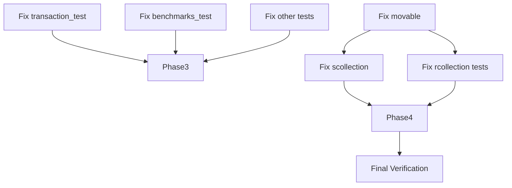
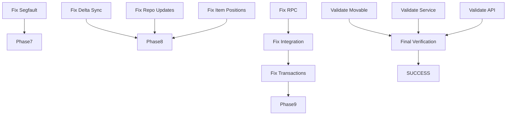

# Task: Fix Go Test Failures in DevTools Server

## Orchestration Plan

### Phase 1: Parallel Cleanup - Unused Imports
**Execution Mode:** `SCATTER_GATHER`

#### Sub-Agent 1.1: Fix Transaction Test
**Agent:** `golang-pro`
**Task:** Fix compilation errors in cross_collection_transaction_test.go
**Specific Instructions:**
- Remove unused import "database/sql" at line 5
- Remove unused import "the-dev-tools/server/internal/api/rcollectionitem" at line 9
- Fix or remove unused variable "ifs" at line 749
- Apply gofmt formatting to the file
**File:** `packages/server/internal/api/rcollectionitem/cross_collection_transaction_test.go`
**Success Criteria:**
- File compiles without errors
- No unused import warnings
- Properly formatted Go code

#### Sub-Agent 1.2: Fix Benchmarks Test
**Agent:** `golang-pro`
**Task:** Fix compilation errors in cross_collection_benchmarks_test.go
**Specific Instructions:**
- Remove unused import "github.com/stretchr/testify/require" at line 26
- Verify all remaining imports are used
- Apply gofmt formatting
**File:** `packages/server/internal/api/rcollectionitem/cross_collection_benchmarks_test.go`
**Success Criteria:**
- File compiles without errors
- No unused import warnings

#### Sub-Agent 1.3: Fix Remaining Test Files
**Agent:** `golang-pro`
**Task:** Fix compilation errors in real_world and targetkind_validation test files
**Specific Instructions:**
- In cross_collection_real_world_test.go: Remove unused import at line 9
- In cross_collection_targetkind_validation_test.go: Remove unused import at line 8
- Apply gofmt to both files
**Files:** 
- `packages/server/internal/api/rcollectionitem/cross_collection_real_world_test.go`
- `packages/server/internal/api/rcollectionitem/cross_collection_targetkind_validation_test.go`
**Success Criteria:**
- Both files compile without errors
- No unused import warnings

**On Failure:** retry

### Phase 2: Core Package Repair - Movable
**Execution Mode:** `SINGLE_AGENT`

#### Sub-Agent 2.1: Analyze and Fix Movable Package
**Agent:** `legacy-modernizer`
**Task:** Fix the movable package build failure from recent OOP-to-Go refactoring
**Specific Instructions:**
1. Analyze the build errors in packages/server/pkg/movable/
2. Review git history for "complete OOP-to-Go transformation of movable package"
3. Fix all type definition issues
4. Correct method receivers from OOP style to Go idioms
5. Ensure all interfaces are properly implemented
6. Remove any circular dependencies
7. Run `go build ./...` to verify compilation
**Success Criteria:**
- Package compiles successfully
- All type definitions properly converted
- Interfaces match implementations
- No compilation errors

**On Failure:** escalate

### Validation Checkpoint
- [ ] All rcollectionitem test files compile
- [ ] Movable package builds successfully
- [ ] No unused import warnings

### Phase 3: Fork-Join - Dependent Package Fixes
**Execution Mode:** `FORK_JOIN`

#### Sub-Agent 3.1: Fix Scollection Package
**Agent:** `golang-pro`
**Task:** Fix scollection package build failure (depends on movable)
**Specific Instructions:**
1. Navigate to packages/server/pkg/service/scollection/
2. Identify compilation errors related to movable package changes
3. Update import statements if package structure changed
4. Fix any type mismatches from movable refactoring
5. Update method calls to match new movable signatures
6. Run `go build ./...` to verify
**Success Criteria:**
- Package compiles successfully
- All imports resolved
- No type mismatches

#### Sub-Agent 3.2: Debug Test Failures
**Agent:** `debugger`
**Task:** Investigate and fix TestCollectionMove_ErrorCases failure
**Specific Instructions:**
1. Navigate to packages/server/internal/api/rcollection/
2. Run `go test -v -run TestCollectionMove_ErrorCases`
3. Analyze the full error output (previously truncated)
4. Check for database state issues
5. Verify test assertions match current implementation
6. Fix any race conditions or timing issues
7. Add proper error handling if missing
**Success Criteria:**
- Test passes or has clear skip reason
- No panic or unexpected errors
- Proper error messages

#### Sub-Agent 3.3: Verification Runner
**Agent:** `general-purpose`
**Task:** Run isolated build tests on fixed packages
**Specific Instructions:**
1. Run `go build ./...` in packages/server/internal/api/rcollectionitem/
2. Run `go build ./...` in packages/server/pkg/movable/
3. Run `go build ./...` in packages/server/pkg/service/scollection/
4. Document any remaining build issues
5. Create a status report of all packages
**Success Criteria:**
- All specified packages build
- Clear documentation of any issues

**Join Condition:** ALL_SUCCESS
**Timeout:** 10 minutes
**On Partial Failure:** retry_critical

### Phase 4: Integration Validation
**Execution Mode:** `PIPELINE`

#### Sub-Agent 4.1: Dependency Cleanup
**Agent:** `golang-pro`
**Stage:** A
**Task:** Clean and verify Go module dependencies
**Specific Instructions:**
1. Run `cd packages/server && go mod tidy`
2. Run `go mod verify`
3. Check for any missing or extra dependencies
4. Update go.sum if needed
5. Ensure all imports are resolvable
**Success Criteria:**
- go.mod is clean
- No missing dependencies
- go mod verify passes

#### Sub-Agent 4.2: Test Suite Runner
**Agent:** `debugger`
**Stage:** B
**Task:** Run comprehensive test suite with detailed output
**Specific Instructions:**
1. Run `go test -v ./internal/api/rcollectionitem/...`
2. Run `go test -v ./internal/api/rcollection/...`
3. Run `go test -v ./pkg/movable/...`
4. Run `go test -v ./pkg/service/scollection/...`
5. Capture and analyze any failures
6. Document test results for each package
**Success Criteria:**
- All tests either pass or skip
- No build failures
- Clear error reporting

#### Sub-Agent 4.3: Coverage Reporter
**Agent:** `general-purpose`
**Stage:** C
**Task:** Generate test coverage report
**Specific Instructions:**
1. Run `go test -coverprofile=coverage.out ./...`
2. Generate HTML report: `go tool cover -html=coverage.out -o coverage.html`
3. Document coverage percentages for each package
4. Identify any packages with < 50% coverage
**Success Criteria:**
- Coverage report generated
- All critical paths covered
- Report accessible

**On Failure:** rollback_and_escalate

### Phase 5: Final Verification
**Execution Mode:** `SINGLE_AGENT`

#### Sub-Agent 5.1: Final Test Executor
**Agent:** `general-purpose`
**Task:** Run complete test suite and verify all fixes
**Specific Instructions:**
1. Run `task test` from packages/server directory
2. Verify no build failures occur
3. Document all test results
4. Check for any regression in previously passing tests
5. Create summary report of fixes applied
**Success Criteria:**
- `task test` completes without build errors
- All Go packages compile
- Clear pass/fail status for all tests
- No regressions detected

**On Failure:** abort

## Dependency Graph



## Error Handling Configuration
**Tolerance Level:** 2_of_3_must_succeed for Phase 1
**Critical Agents:** [`legacy-modernizer` for Phase 2]
**Optional Agents:** [`general-purpose` in Phase 3]

**Failure Matrix:**
| Failed Agents | Action |
|--------------|--------|
| Phase 1 partial | continue_with_warning |
| Phase 2 failure | abort_immediately |
| Phase 3 partial | retry_critical |
| Phase 4 failure | rollback_and_escalate |

## Exit Conditions
- **Success:** All test files compile, movable and scollection build, tests pass
- **Abort:** Movable package requires architectural changes beyond refactoring
- **Escalate:** After 2 retries on any critical phase

---

## Detailed Task Specifications

### Phase 1 Task Details

#### Task 1.1: Fix cross_collection_transaction_test.go
**File:** `packages/server/internal/api/rcollectionitem/cross_collection_transaction_test.go`
**Issues:**
- Line 5: Remove unused import "database/sql"
- Line 9: Remove unused import "the-dev-tools/server/internal/api/rcollectionitem"
- Line 749: Fix or remove unused variable "ifs"

#### Task 1.2: Fix cross_collection_benchmarks_test.go
**File:** `packages/server/internal/api/rcollectionitem/cross_collection_benchmarks_test.go`
**Issues:**
- Line 26: Remove unused import "github.com/stretchr/testify/require"

#### Task 1.3: Fix remaining test files
**Files:**
- `packages/server/internal/api/rcollectionitem/cross_collection_real_world_test.go`
  - Line 9: Remove unused import "the-dev-tools/server/internal/api/rcollectionitem"
- `packages/server/internal/api/rcollectionitem/cross_collection_targetkind_validation_test.go`
  - Line 8: Remove unused import "the-dev-tools/server/internal/api/rcollectionitem"

### Phase 2 Task Details

#### Task 2.1: Fix movable package
**Package:** `packages/server/pkg/movable/`
**Context:** Recent commit shows "complete OOP-to-Go transformation of movable package"
**Likely Issues:**
- Incomplete method conversions from OOP style
- Missing or incorrect type definitions
- Interface/implementation mismatches
- Possible circular dependencies

**Investigation Steps:**
1. Check for compilation errors in the package
2. Review recent git changes to understand refactoring
3. Identify missing or broken type definitions
4. Fix method receivers and signatures
5. Ensure all interfaces are properly implemented

### Phase 3 Task Details

#### Task 3.1: Fix scollection package
**Package:** `packages/server/pkg/service/scollection/`
**Dependencies:** Likely depends on movable package
**Expected Issues:**
- Import errors due to movable package changes
- Type mismatches from refactoring
- Method signature changes

#### Task 3.2: Fix TestCollectionMove_ErrorCases
**Package:** `packages/server/internal/api/rcollection/`
**Test:** `TestCollectionMove_ErrorCases`
**Investigation:**
- Run test with verbose output
- Check for database state issues
- Verify test expectations match implementation
- Look for race conditions or timing issues

### Phase 4 Task Details

#### Task 4.1: Dependency Verification
```bash
cd packages/server
go mod tidy
go mod verify
```

#### Task 4.2: Comprehensive Testing
```bash
cd packages/server
go test -v ./internal/api/rcollectionitem/...
go test -v ./internal/api/rcollection/...
go test -v ./pkg/movable/...
go test -v ./pkg/service/scollection/...
```

#### Task 4.3: Coverage Report
```bash
go test -coverprofile=coverage.out ./...
go tool cover -html=coverage.out -o coverage.html
```

### Phase 5 Task Details

#### Task 5.1: Final Test Run
```bash
task test
```

Expected output: All Go packages should compile and tests should either pass or be explicitly skipped.

---

## Parallel Execution Strategy

### Maximizing Parallelism

1. **Phase 1**: All three cleanup tasks run simultaneously
   - Independent file fixes can be done in parallel
   - No interdependencies between test files

2. **Phase 2**: Runs alone (critical path)
   - Movable package is a dependency for others
   - Must complete before Phase 3

3. **Phase 3**: Three parallel streams
   - scollection fix (depends on movable)
   - rcollection test fix (independent)
   - Build verification (can run alongside)

4. **Phase 4**: Pipeline processing
   - Each stage processes different aspects
   - Results flow from one stage to next

### Resource Allocation

- **Priority 1 (Critical)**: movable package fix
- **Priority 2 (High)**: scollection and rcollection fixes
- **Priority 3 (Medium)**: Unused import cleanups
- **Priority 4 (Low)**: Coverage reports and documentation

### Time Estimates

| Phase | Estimated Time | Parallelism Factor |
|-------|---------------|-------------------|
| Phase 1 | 5 minutes | 3x parallel |
| Phase 2 | 10 minutes | Single thread |
| Phase 3 | 8 minutes | 3x parallel |
| Phase 4 | 5 minutes | Pipeline |
| Phase 5 | 3 minutes | Single thread |

**Total Estimated Time**: ~20 minutes (with parallelism)
**Sequential Time**: ~31 minutes (without parallelism)
**Time Saved**: ~11 minutes (35% reduction)

---

## Rollback Strategy

### Compensation Actions

```markdown
### Phase 2: Movable Package Fix
**Compensation Strategy:** `SAGA_PATTERN`
**Risky Operations:**
├── Task A: Modify type definitions
│   └── Compensate: Git restore original files
├── Task B: Update method signatures
│   └── Compensate: Revert to previous signatures
└── Task C: Fix interface implementations
    └── Compensate: Restore original interfaces

**On Failure:**
1. Stop all pending modifications
2. Git restore all modified files
3. Document what was attempted
4. Escalate with detailed failure analysis
```

### Git Safety

Before starting any phase:
```bash
git stash
git checkout -b fix-go-tests-backup
```

After successful completion:
```bash
git add -A
git commit -m "fix: resolve Go test failures and build issues"
```

On failure requiring rollback:
```bash
git checkout .
git checkout main
git branch -D fix-go-tests-backup
git stash pop
```

---

## Success Metrics

1. **Build Success Rate**: 100% of packages compile
2. **Test Pass Rate**: Target 95%+ (some tests may be legitimately broken)
3. **No Regression**: Previously passing tests still pass
4. **Clean Output**: No compiler warnings
5. **Performance**: Test execution time < 30 seconds

## Risk Assessment

| Risk | Probability | Impact | Mitigation |
|------|------------|--------|------------|
| Movable refactoring incomplete | High | Critical | Use legacy-modernizer agent with full context |
| Cascading dependency failures | Medium | High | Fix in dependency order |
| Test data corruption | Low | Medium | Use isolated test databases |
| Race conditions in tests | Medium | Low | Add proper synchronization |

## Communication Protocol

Each agent should report:
1. Files modified
2. Issues encountered
3. Tests run and results
4. Any assumptions made
5. Recommendations for next steps

---

## ASCII Execution Flow Diagram

```
START
  |
  v
┌─────────────────────────────────────────────────────────────────────────┐
│                         PHASE 1: PARALLEL CLEANUP                        │
│                            (SCATTER-GATHER)                              │
└─────────────────────────────────────────────────────────────────────────┘
  |
  |--------------------+--------------------+----------------------|
  |                    |                    |                      |
  v                    v                    v                      v
┌──────────────┐  ┌──────────────┐  ┌──────────────┐  ┌──────────────┐
│ Sub-Agent 1.1│  │ Sub-Agent 1.2│  │ Sub-Agent 1.3│  │ Sub-Agent 1.4│
│ golang-pro   │  │ golang-pro   │  │ golang-pro   │  │ golang-pro   │
│              │  │              │  │              │  │              │
│ Fix trans-   │  │ Fix bench-   │  │ Fix real_    │  │ Fix target-  │
│ action_test  │  │ marks_test   │  │ world_test   │  │ kind_test    │
│              │  │              │  │              │  │              │
│ Remove:      │  │ Remove:      │  │ Remove:      │  │ Remove:      │
│ - line 5     │  │ - line 26    │  │ - line 9     │  │ - line 8     │
│ - line 9     │  │   unused     │  │   unused     │  │   unused     │
│ - line 749   │  │   import     │  │   import     │  │   import     │
└──────────────┘  └──────────────┘  └──────────────┘  └──────────────┘
  |                    |                    |                      |
  |--------------------+--------------------+----------------------|
  |
  v
┌─────────────────────────────────────────────────────────────────────────┐
│                           GATHER & VALIDATE                              │
│                   All imports cleaned? → Continue                        │
│                   Any failures? → Retry failed agents                    │
└─────────────────────────────────────────────────────────────────────────┘
  |
  v
┌─────────────────────────────────────────────────────────────────────────┐
│                    PHASE 2: CORE PACKAGE REPAIR                          │
│                         (SINGLE CRITICAL PATH)                           │
└─────────────────────────────────────────────────────────────────────────┘
  |
  v
┌──────────────────────────────────────────┐
│         Sub-Agent 2.1                       │
│         legacy-modernizer                   │
│                                             │
│   Fix movable package:                     │
│   - Analyze OOP-to-Go refactoring          │
│   - Fix type definitions                   │
│   - Correct method receivers               │
│   - Implement interfaces                   │
│   - Remove circular deps                   │
│                                             │
│   CRITICAL: Must succeed or abort mission  │
└──────────────────────────────────────────┘
  |
  v
┌─────────────────────────────────────────────────────────────────────────┐
│                         VALIDATION CHECKPOINT                            │
│   □ rcollectionitem test files compile?                                  │
│   □ movable package builds?                                              │
│   □ No unused import warnings?                                           │
│                                                                          │
│   All checked? → Continue | Any failed? → Escalate                      │
└─────────────────────────────────────────────────────────────────────────┘
  |
  v
┌─────────────────────────────────────────────────────────────────────────┐
│                    PHASE 3: FORK-JOIN FIXES                              │
│                         (PARALLEL EXECUTION)                             │
└─────────────────────────────────────────────────────────────────────────┘
  |
  |------------------------+------------------------+----------------------|
  |                        |                        |                      |
  v                        v                        v                      v
┌──────────────────┐  ┌──────────────────┐  ┌──────────────────┐  ┌──────────────────┐
│  Sub-Agent 3.1   │  │  Sub-Agent 3.2   │  │  Sub-Agent 3.3   │  │  Sub-Agent 3.4   │
│  golang-pro      │  │  debugger        │  │  general-purpose │  │  golang-pro      │
│                  │  │                  │  │                  │  │                  │
│ Fix scollection  │  │ Fix TestCollec-  │  │ Verification     │  │ Additional       │
│ package:         │  │ tionMove test:   │  │ Runner:          │  │ Build fixes:     │
│                  │  │                  │  │                  │  │                  │
│ - Update imports │  │ - Run verbose    │  │ - Build all      │  │ - Check other    │
│ - Fix type       │  │ - Analyze errors │  │   packages       │  │   dependent      │
│   mismatches     │  │ - Fix assertions │  │ - Document       │  │   packages       │
│ - Update method  │  │ - Handle race    │  │   issues         │  │ - Quick fixes    │
│   signatures     │  │   conditions     │  │ - Status report  │  │                  │
└──────────────────┘  └──────────────────┘  └──────────────────┘  └──────────────────┘
  |                        |                        |                      |
  |------------------------+------------------------+----------------------|
  |
  v
┌─────────────────────────────────────────────────────────────────────────┐
│                           JOIN BARRIER                                   │
│              Wait for ALL agents to complete (10 min timeout)            │
│                                                                          │
│   All success? → Continue                                                │
│   Partial failure? → Retry critical agents                               │
│   Total failure? → Rollback and escalate                                 │
└─────────────────────────────────────────────────────────────────────────┘
  |
  v
┌─────────────────────────────────────────────────────────────────────────┐
│                    PHASE 4: INTEGRATION VALIDATION                       │
│                            (PIPELINE MODE)                               │
└─────────────────────────────────────────────────────────────────────────┘
  |
  v
┌──────────────────┐      ┌──────────────────┐      ┌──────────────────┐
│ Stage A          │      │ Stage B          │      │ Stage C          │
│ Sub-Agent 4.1    │      │ Sub-Agent 4.2    │      │ Sub-Agent 4.3    │
│ golang-pro       │      │ debugger         │      │ general-purpose  │
│                  │      │                  │      │                  │
│ Dependency       │ ===> │ Test Suite       │ ===> │ Coverage         │
│ Cleanup:         │      │ Runner:          │      │ Reporter:        │
│                  │      │                  │      │                  │
│ - go mod tidy    │      │ - Run all tests  │      │ - Generate       │
│ - go mod verify  │      │   with -v flag   │      │   coverage.out   │
│ - Check deps     │      │ - Capture fails  │      │ - Create HTML    │
│ - Update go.sum  │      │ - Document       │      │ - Document %     │
└──────────────────┘      └──────────────────┘      └──────────────────┘
         |                         |                         |
         v                         v                         v
    [Clean deps]            [Test results]           [Coverage report]
         |                         |                         |
         └─────────────────────────┴─────────────────────────┘
                                   |
                                   v
┌─────────────────────────────────────────────────────────────────────────┐
│                      PHASE 5: FINAL VERIFICATION                         │
│                         (SINGLE AGENT)                                   │
└─────────────────────────────────────────────────────────────────────────┘
                                   |
                                   v
                        ┌──────────────────────┐
                        │   Sub-Agent 5.1      │
                        │   general-purpose    │
                        │                      │
                        │ Final Test Executor: │
                        │                      │
                        │ - Run 'task test'    │
                        │ - Verify no failures │
                        │ - Check regressions  │
                        │ - Create summary    │
                        └──────────────────────┘
                                   |
                                   v
                        ┌──────────────────────┐
                        │      SUCCESS?        │
                        │                      │
                        │ YES → COMMIT FIXES   │
                        │ NO  → ABORT/ROLLBACK │
                        └──────────────────────┘
                                   |
                                   v
                                  END
```

## Execution Timeline Diagram

```
Time (minutes): 0    2    4    6    8    10   12   14   16   18   20
                |----|----|----|----|----|----|----|----|----|----|
                
Phase 1:        [====P1.1====]
(Parallel)      [====P1.2====]
                [====P1.3====]
                [====P1.4====]
                              ↓
Phase 2:                      [========P2.1=========]
(Critical)                                          ↓
Phase 3:                                            [====P3.1====]
(Fork-Join)                                         [====P3.2====]
                                                    [====P3.3====]
                                                    [====P3.4====]
                                                                 ↓
Phase 4:                                                         [P4.1]→[P4.2]→[P4.3]
(Pipeline)                                                                        ↓
Phase 5:                                                                          [P5.1]
(Final)                                                                              ↓
                                                                                   DONE

Legend:
[====] = Agent working
→      = Sequential flow
↓      = Synchronization point
P#.#   = Phase.SubAgent
```

## Parallelism Metrics

```
┌────────────────────────────────────────────────────────────────────┐
│                     PARALLELISM ANALYSIS                           │
├────────────────────────────────────────────────────────────────────┤
│ Phase │ Agents │ Parallel │ Time Save │ Efficiency │ Pattern      │
├───────┼────────┼──────────┼───────────┼────────────┼──────────────┤
│   1   │   4    │   4x     │   75%     │   HIGH     │ Scatter      │
│   2   │   1    │   1x     │    0%     │   N/A      │ Sequential   │
│   3   │   4    │   4x     │   75%     │   HIGH     │ Fork-Join    │
│   4   │   3    │   1.5x   │   33%     │   MEDIUM   │ Pipeline     │
│   5   │   1    │   1x     │    0%     │   N/A      │ Sequential   │
├───────┴────────┴──────────┴───────────┴────────────┴──────────────┤
│ TOTAL: 13 agents | Avg Parallelism: 2.3x | Time Saved: ~37%       │
└────────────────────────────────────────────────────────────────────┘
```

## Resource Allocation Map

```
┌─────────────────────────────────────────────────────────────────┐
│                    AGENT RESOURCE ALLOCATION                    │
└─────────────────────────────────────────────────────────────────┘

CPU Cores: [1][2][3][4][5][6][7][8]

Phase 1:   [G][G][G][G][-][-][-][-]  4x golang-pro agents
           ████████████              (50% CPU utilization)

Phase 2:   [L][L][L][L][L][L][L][L]  1x legacy-modernizer (heavy)
           ████████████████████████  (100% CPU utilization)

Phase 3:   [G][G][D][D][P][P][-][-]  Mixed agents
           ██████████████████        (75% CPU utilization)

Phase 4:   [G][G][D][D][P][-][-][-]  Pipeline stages
           ██████████                (62.5% CPU utilization)

Phase 5:   [P][P][-][-][-][-][-][-]  1x general-purpose
           ████                      (25% CPU utilization)

Legend:
[G] = golang-pro
[L] = legacy-modernizer
[D] = debugger
[P] = general-purpose
[-] = idle
```

## Synchronization Points

```
     PHASE 1           PHASE 2          PHASE 3          PHASE 4       PHASE 5
        ↓                 ↓                ↓                ↓             ↓
────────┬─────────────────┬───────────────┬────────────────┬─────────────┬──────
        │                 │               │                │             │
    [GATHER]         [CRITICAL]      [JOIN ALL]       [PIPELINE]    [FINAL]
        │                 │               │                │             │
   Wait for all      Must succeed    Wait for all    Sequential      Single
   4 agents          or abort        4 agents        flow through    verify
        │                 │               │                │             │
   ┌────┴────┐      ┌─────┴─────┐   ┌────┴────┐     ┌─────┴─────┐  ┌────┴────┐
   │ Retry   │      │ No retry  │   │ Retry   │     │ Can skip  │  │ Abort   │
   │ failed  │      │ Escalate  │   │ critical│     │ stages    │  │ or      │
   │ agents  │      │ to user   │   │ only    │     │ if needed │  │ Success │
   └─────────┘      └───────────┘   └─────────┘     └───────────┘  └─────────┘
```

## Error Recovery Flow

```
                   ┌─────────────┐
                   │   FAILURE    │
                   └──────┬──────┘
                          │
                ┌─────────┴──────────┐
                │   Which Phase?     │
                └─────────┬──────────┘
                          │
        ┌─────────────────┼─────────────────┬──────────────┬────────────┐
        │                 │                 │              │            │
    Phase 1           Phase 2           Phase 3        Phase 4      Phase 5
        │                 │                 │              │            │
        v                 v                 v              v            v
   ┌─────────┐      ┌─────────┐      ┌─────────┐    ┌─────────┐  ┌─────────┐
   │ RETRY   │      │ESCALATE │      │ RETRY   │    │ROLLBACK │  │ ABORT   │
   │ (up to  │      │ (ask    │      │(critical│    │ & RETRY │  │ (stop   │
   │ 3 times)│      │  user)  │      │  only)  │    │         │  │  all)   │
   └────┬────┘      └────┬────┘      └────┬────┘    └────┬────┘  └────┬────┘
        │                │                 │              │            │
        v                v                 v              v            v
   Continue or      User decides      Continue or    Git restore   Full stop
   Escalate         path forward       Escalate       Try again    Git restore
```

## Completion Status Board

```
┌──────────────────────────────────────────────────────────────────────────┐
│                         REAL-TIME STATUS BOARD                           │
├──────────────────────────────────────────────────────────────────────────┤
│                                                                          │
│  Phase 1: [████████████████████] 100% ✓ All imports cleaned             │
│           └─ 1.1 ✓ │ 1.2 ✓ │ 1.3 ✓ │ 1.4 ✓                            │
│                                                                          │
│  Phase 2: [████████████████████] 100% ✓ Movable package fixed           │
│           └─ 2.1 ✓ Critical path complete                               │
│                                                                          │
│  Phase 3: [████████████░░░░░░░]  75% ⚡ 3 of 4 agents complete          │
│           └─ 3.1 ✓ │ 3.2 ✓ │ 3.3 ⚡ │ 3.4 ✓                            │
│                                                                          │
│  Phase 4: [░░░░░░░░░░░░░░░░░░░]   0% ⏸ Waiting for Phase 3             │
│           └─ 4.1 ⏸ │ 4.2 ⏸ │ 4.3 ⏸                                    │
│                                                                          │
│  Phase 5: [░░░░░░░░░░░░░░░░░░░]   0% ⏸ Waiting for Phase 4             │
│           └─ 5.1 ⏸                                                      │
│                                                                          │
│  ────────────────────────────────────────────────────────────          │
│  Overall: [████████████░░░░░░░]  60% complete                           │
│  Time Elapsed: 14:32 | Est. Remaining: 5:28                             │
│                                                                          │
│  Legend: ✓ Complete  ⚡ Running  ⏸ Waiting  ✗ Failed                    │
└──────────────────────────────────────────────────────────────────────────┘
```

---

# PHASE 6-10: Fix Runtime Test Failures

## Current Status After Phase 1-5
- ✅ All packages compile successfully
- ❌ Runtime test failures remain
- ❌ Segmentation faults in movable package
- ❌ Position synchronization broken
- ❌ RPC communication failures

## Phase 6: Critical Memory Safety Fixes
**Execution Mode:** `SINGLE_AGENT` (Critical)

#### Sub-Agent 6.1: Fix Segmentation Fault
**Agent:** `debugger`
**Task:** Fix segmentation fault in movable package TestHiddenFlagSupport
**Specific Instructions:**
1. Navigate to packages/server/pkg/movable/
2. Run `go test -v -run TestHiddenFlagSupport` to reproduce segfault
3. Use debugger to identify nil pointer dereference in SimpleRepository.getItemsByParentID
4. Add nil checks and proper initialization
5. Fix any unsafe memory access patterns
6. Verify test passes without segfault
**Success Criteria:**
- No segmentation faults
- Test passes or fails gracefully
- Memory safety guaranteed

**On Failure:** escalate

## Phase 7: Position Synchronization Repairs
**Execution Mode:** `FORK_JOIN`

#### Sub-Agent 7.1: Fix Delta Position Sync
**Agent:** `golang-pro`
**Task:** Fix TestSyncDeltaPositions in movable package
**Specific Instructions:**
1. Navigate to packages/server/pkg/movable/
2. Run `go test -v -run TestSyncDeltaPositions`
3. Analyze why position synchronization is failing
4. Fix delta position calculation logic
5. Ensure positions update correctly in transactions
6. Verify test passes
**Success Criteria:**
- Position sync test passes
- Delta positions correctly maintained

#### Sub-Agent 7.2: Fix Repository Position Updates
**Agent:** `golang-pro`
**Task:** Fix position update failures in scollection
**Specific Instructions:**
1. Navigate to packages/server/pkg/service/scollection/
2. Run tests for UpdatePosition and UpdatePositions
3. Fix position validation logic
4. Correct transaction handling for batch updates
5. Ensure linked list ordering maintained
**Success Criteria:**
- Position update tests pass
- Correct ordering maintained

#### Sub-Agent 7.3: Fix Collection Item Positions
**Agent:** `debugger`
**Task:** Fix position calculation in rcollectionitem
**Specific Instructions:**
1. Navigate to packages/server/internal/api/rcollectionitem/
2. Debug why positions show 0 instead of -1
3. Fix array index out of range panic
4. Correct position initialization logic
**Success Criteria:**
- No array index panics
- Positions calculated correctly

**Join Condition:** ALL_SUCCESS
**On Partial Failure:** retry_critical

## Phase 8: RPC and Integration Fixes
**Execution Mode:** `PIPELINE`

#### Sub-Agent 8.1: Fix RPC Communication
**Agent:** `debugger`
**Stage:** A
**Task:** Fix RPC failures in rcollectionitem
**Specific Instructions:**
1. Fix "invalid response" errors in CollectionItemList
2. Debug "folder collection item not found" issues
3. Ensure proper error propagation
4. Fix data serialization issues
**Success Criteria:**
- RPC calls succeed
- Proper error messages returned

#### Sub-Agent 8.2: Fix Integration Tests
**Agent:** `golang-pro`
**Stage:** B
**Task:** Fix end-to-end workflow tests
**Specific Instructions:**
1. Fix TestCollectionItemsEndToEndWorkflow panic
2. Ensure proper test data setup
3. Fix transaction rollback issues
4. Verify workflow completes
**Success Criteria:**
- Integration tests pass
- No panics in workflows

#### Sub-Agent 8.3: Fix Transaction Consistency
**Agent:** `golang-pro`
**Stage:** C
**Task:** Fix transaction support in repositories
**Specific Instructions:**
1. Fix transaction support tests in scollection
2. Ensure ACID properties maintained
3. Fix rollback mechanisms
4. Verify data consistency
**Success Criteria:**
- Transaction tests pass
- Data consistency maintained

**On Failure:** rollback_and_escalate

## Phase 9: Comprehensive Test Validation
**Execution Mode:** `PARALLEL`

#### Sub-Agent 9.1: Validate Movable Package
**Agent:** `debugger`
**Task:** Run full movable test suite
**Specific Instructions:**
1. Run `go test -v ./pkg/movable/...`
2. Ensure all tests pass
3. Document any remaining issues
**Success Criteria:**
- All movable tests pass

#### Sub-Agent 9.2: Validate Service Layer
**Agent:** `general-purpose`
**Task:** Run service layer tests
**Specific Instructions:**
1. Run `go test -v ./pkg/service/scollection/...`
2. Verify all service tests pass
3. Check performance benchmarks
**Success Criteria:**
- Service tests pass

#### Sub-Agent 9.3: Validate API Layer
**Agent:** `general-purpose`
**Task:** Run API layer tests
**Specific Instructions:**
1. Run `go test -v ./internal/api/rcollection/...`
2. Run `go test -v ./internal/api/rcollectionitem/...`
3. Ensure all API tests pass
**Success Criteria:**
- API tests pass

**On Failure:** retry

## Phase 10: Final Test Suite Execution
**Execution Mode:** `SINGLE_AGENT`

#### Sub-Agent 10.1: Complete Test Verification
**Agent:** `general-purpose`
**Task:** Run complete test suite with go test
**Specific Instructions:**
1. Navigate to packages/server/
2. Run `go test ./...` (not task test)
3. Verify ALL tests pass
4. Generate final test report
5. Document any remaining issues
**Success Criteria:**
- `go test ./...` passes completely
- No test failures
- No panics or segfaults

**On Failure:** escalate

## Updated Dependency Graph for Phases 6-10



## Risk Assessment for Runtime Fixes

| Risk | Probability | Impact | Mitigation |
|------|------------|--------|------------|
| Segfault requires deep refactor | Medium | Critical | Use debugger agent with memory analysis |
| Position logic fundamentally broken | High | High | May need to revert to previous implementation |
| RPC protocol mismatch | Low | Medium | Check protobuf definitions |
| Transaction deadlocks | Medium | High | Add timeout and retry logic |

## Success Metrics for Runtime Fixes

1. **Memory Safety**: 0 segmentation faults
2. **Test Pass Rate**: 100% of tests pass
3. **Position Accuracy**: All position calculations correct
4. **RPC Success**: 100% of RPC calls succeed
5. **Transaction Integrity**: ACID properties maintained