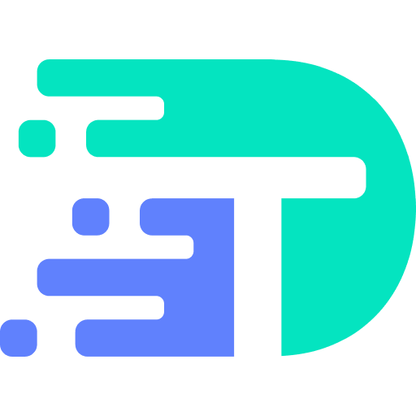

  

<h1 align="center">DevTools</h1>

A free, open‑source Postman‑style API tester you run locally. Record browser requests, auto‑generate chained tests, and ship them straight to your CI—no sign‑ups, no cloud, just code.

  
Table of Contents

  <ol>
    <li><a href="#about-the-project">About the Project</a></li>
    <li><a href="#chrome-extension">Chrome Extension</a></li>
    <li><a href="#contributing">Contributing</a></li>
    <li><a href="#license">License</a></li>
  </ol>

## About the Project

DevTools gives developers complete control over their API testing workflows:

- **Browser Request Recording**: Automatically capture all API requests and responses from your browser sessions.
- **No-code Test Generation**: Transform your recorded API requests into reusable test collections.
- **Request Chaining**: Easily create complex test flows with automatic data extraction and variable chaining between requests.
- **100% Local Execution**: Run tests on your local machine without sending data to third-party services.
- **CI/CD Integration**: Seamlessly integrate your API tests into any CI/CD pipeline.
- **Zero Configuration**: Start testing in seconds without complex setup or authentication.
- **Privacy First**: Keep your sensitive API data and credentials secure on your own machine.
- **Postman-Compatible**: Import from Postman-like JSON files and export collections for cross-platform compatibility.

DevTools combines the best aspects of Postman's visual interface with the security and flexibility of local-first, code-driven development. No sign-ups, no cloud dependencies - just powerful API testing tools that integrate perfectly with your development workflow.

### Postman-Style Request Interface

The DevTools interface provides a familiar Postman-like experience for working with API requests. The screenshot above shows the request editor interface with form data input, allowing you to easily build, test, and organize your API requests without the cloud dependency.

### Visual Flow Builder

The flow builder allows you to visually chain API requests and create complex test scenarios. Connect different nodes to build your workflow:
- **Request nodes**: Execute API calls in sequence
- **Conditional nodes**: Add if-statement logic based on response data
- **Loop nodes**: Iterate through data sets with for-each loops
- **Data nodes**: Import data from Excel sheets and other sources

This visual approach makes it easy to create sophisticated API workflows without writing code.

## Chrome Extension

The DevTools API Recorder extension captures your API interactions in real-time:

- **One-Click Recording**: Start and pause API recording with a single click in any browser tab
- **Request Organization**: Automatically categorizes requests by domain and endpoint
- **Complete Request Details**: Capture headers, query parameters, body content, and responses
- **Response Inspection**: Examine API responses with syntax highlighting
- **Secure & Private**: All captured data remains in your browser—nothing is transmitted to external servers

The extension works seamlessly with the main DevTools application, allowing you to record APIs in your browser and then use them to build sophisticated test flows and documentation.

## Contributing

We appreciate feedback and contribution to this repo! Before you get started, please see the following:

- [Contribution guidelines](./docs/CONTRIBUTING.md)
- [Code of conduct guidelines](./docs/CODE-OF-CONDUCT.md)

## License

This project is distributed under the **MIT License + Commons Clause** (source‑available).

You are free to use, modify, and distribute the software under the MIT terms **except** as limited below.

**Commons Clause Restriction**  
You may **not sell** the software **or** provide it (or any service whose value derives substantially from its functionality) as a hosted/SaaS offering without first obtaining a commercial licence.

**Permitted without a commercial licence**

- Local development and personal use  
- Internal business use (including self‑hosted CI/CD)  
- Commercial products that run entirely on the customer's own machines (non‑SaaS)

For hosted or managed‑service use, contact **licensing@dev.tools**.

See the [LICENSE](./LICENSE) file for full details.
