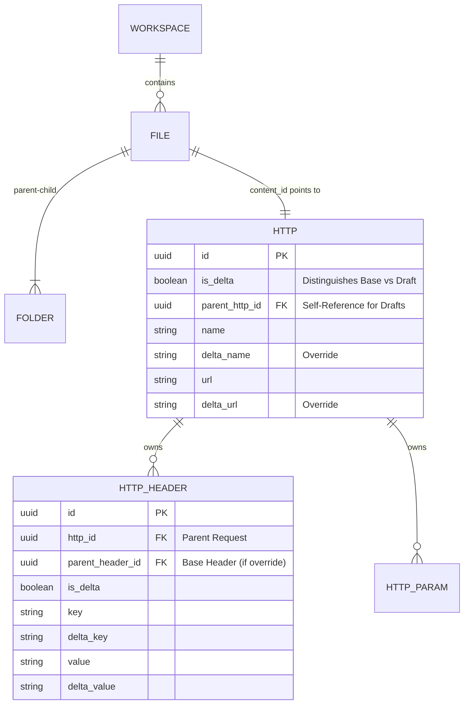

# The Delta System: Comprehensive Architecture & Data Flow

**Status:** Active
**Version:** 1.1
**Last Updated:** 2025-11-26

---

## 1. Executive Summary

The **Delta System** is the backbone of DevTools' real-time, offline-first architecture. It is not merely a synchronization protocol but a fundamental **Data Modeling Paradigm** that pervades the Database (SQL), the API (Protobuf/RPC), and the Client State (TanStack DB).

Its primary engineering goals are:

1.  **Ambiguity Resolution:** Solving the "Null vs. Undefined" problem in strongly typed systems (Protobuf/Go) to distinguish between _ignoring_ a field and _erasing_ it.
2.  **Non-Destructive Editing:** Enabling "Draft," "Patch," and "Branch" workflows where users can modify complex entities (like HTTP Requests) without altering the canonical "Live" version.
3.  **Granular Conflict Resolution:** allowing multiple users to edit different properties (e.g., Headers vs. Body) of the same request simultaneously without Last-Write-Wins data loss.

---

## 2. The "Split-Entity" Architecture

To understand the Delta System, one must first understand how DevTools separates **Structure** (The File System) from **Content** (The Domain Data).

### 2.1 The `File` Entity (Structure)

The `files` table acts as the skeleton of the workspace. It cares _only_ about hierarchy, ordering, and identity. It does not know _what_ an HTTP request is; it only knows where it lives.

**Key Responsibilities:**

- **Tree Topology:** Maintains `folder_id` and `display_order`.
- **Polymorphism:** Uses `content_kind` (Enum) and `content_id` (UUID) to point to the actual data.
- **Virtualization:** Allows "Ghost" files or "Link" files to exist without heavy data payloads.

**Schema Reference (`files`):**

```sql
CREATE TABLE files (
  id BLOB PRIMARY KEY,             -- The "File Handle"
  folder_id BLOB,                  -- Pointer to parent Folder (Recursive)
  content_id BLOB,                 -- Pointer to the Data (e.g., http.id)
  content_kind INT8,               -- 0=Folder, 1=Http, 2=Flow
  name TEXT,                       -- Display Name (Denormalized)
  ...
);
```

### 2.2 The `Http` Entity (Content)

The `http` table stores the actual domain logic. It is a "Heavy" entity containing configuration, headers, body, and execution history.

**Key Responsibilities:**

- **Domain Logic:** Stores `method`, `url`, `body_kind`.
- **Execution Context:** Stores `last_run_at` and response history.
- **Self-Containment:** Crucially, the `http` table contains a copy of `name` and `folder_id`. This **Denormalization** ensures that the HTTP execution engine can run a request efficiently without joining the `files` table for basic metadata.

### 2.3 The Bridge: `content_id`

The relationship is defined as:

> **One `File` Entry points to One `Http` Entry.**

When a user clicks a file in the sidebar:

1.  The Frontend reads the `File` record to get the `content_id`.
2.  It performs a lookup in the `Http` store using that `content_id`.
3.  This decoupling allows a single HTTP Definition to potentially be referenced by multiple Files (like symlinks), though currently, it is a 1:1 strict mapping.

---

## 3. The Delta Mechanism: Database Implementation

The core of the Delta System is the **Shadow Row Pattern** implemented via **Single Table Inheritance** within the `http` table (and its children).

Instead of a separate `http_deltas` table, "Live" requests and "Draft" (Delta) requests live together.

### 3.1 The Shadow Row Schema

Every updateable column in the `http` table has a corresponding `delta_*` counterpart.

```sql
CREATE TABLE http (
  id BLOB PRIMARY KEY,

  -- Identity Flags
  is_delta BOOLEAN DEFAULT FALSE,  -- DIFFERENTIATOR
  parent_http_id BLOB,             -- Pointer to the "Base" version

  -- Canonical Columns (Used when is_delta=FALSE)
  name TEXT,
  url TEXT,
  method TEXT,

  -- Delta Columns (Used when is_delta=TRUE)
  delta_name TEXT,        -- If NULL, inherit parent's name
  delta_url TEXT,         -- If NULL, inherit parent's URL
  delta_method TEXT       -- If NULL, inherit parent's Method
);
```

### 3.2 Resolution Logic (The "Overlay")

When the Backend (or Frontend) reads a **Delta** record (`is_delta = TRUE`), it must perform a **Resolution Step**:

1.  **Fetch** the Delta Record.
2.  **Fetch** the Parent Record (via `parent_http_id`).
3.  **Merge** properties:
    - `Resolved.Name` = `Delta.delta_name` ?? `Parent.name`
    - `Resolved.URL` = `Delta.delta_url` ?? `Parent.url`

**Implication:**
This allows a "Draft" to be lightweight. If you only change the HTTP Method in a draft, the `delta_url`, `delta_body`, etc., remain `NULL`. The Draft strictly stores the _Difference_.

### 3.3 The "Unset" Sentinel

What if the user _deletes_ the URL in a draft? We cannot simply set `delta_url = NULL`, because `NULL` means "Inherit from Parent".

**The Solution:**
The TypeSpec definition (`@withDelta`) generates strict Union types (`string | Unset`).

- **In SQL:** This is often handled via a specific empty string convention or an auxiliary flag, depending on the specific column type. For simple text fields, an empty string `""` might be a valid value, so we rely on the `Unset` scalar in the application layer (Go/Typescript) to decide whether to write `NULL` or `""` to the DB, or use a specific sentinel value if strict differentiation is needed.
- **In Protobuf:** The `Unset` is an explicit Enum Member in a `OneOf` field, removing all ambiguity.

---

## 4. Deep Deltas: Recursive Hierarchy

The complexity increases with child entities (Headers, Params, Body Parts). A "Draft" of an HTTP Request implies a "Draft" of its Headers too.

### 4.1 The Child Delta Pattern

Child tables (`http_header`, `http_search_param`) mirror the `http` table's structure.

```sql
CREATE TABLE http_header (
  id BLOB PRIMARY KEY,
  http_id BLOB,                    -- FK to the HTTP Request (Base or Delta)

  -- Delta Identity
  is_delta BOOLEAN DEFAULT FALSE,
  parent_header_id BLOB,           -- FK to the "Base" Header

  -- Content
  key TEXT,      delta_key TEXT,
  value TEXT,    delta_value TEXT,
  enabled BOOL,  delta_enabled BOOL
);
```

### 4.2 The Three States of a Child Delta

When working inside a Draft Request (`HttpDelta`), the headers can be in three states:

#### State A: Inherited (Unmodified)

- The Draft Request points to the **Base** Headers.
- Technically, the Draft might not even record these rows if strictly lazy. But typically, for read performance, we might view the "Base" headers directly.

#### State B: Modified (Override)

- User changes `Content-Type: application/json` to `application/xml` in the draft.
- **Action:** A new row is inserted into `http_header`.
  - `http_id`: Points to the _Delta_ Request.
  - `parent_header_id`: Points to the _Original_ Header.
  - `is_delta`: TRUE.
  - `delta_value`: "application/xml".
  - `delta_key`: NULL (Inherit "Content-Type").

#### State C: Added (New)

- User adds `Authorization: Bearer ...` in the draft.
- **Action:** A new row is inserted into `http_header`.
  - `http_id`: Points to the _Delta_ Request.
  - `parent_header_id`: **NULL** (No parent to inherit from).
  - `is_delta`: TRUE.
  - `key`: "Authorization" (Stored in base column because it's a root definition for this delta).

#### State D: Deleted (Unset)

- User removes a header in the draft.
- **Action:** A new row is inserted/updated in `http_header`.
  - `parent_header_id`: Points to the _Original_ Header.
  - `delta_enabled`: FALSE (Soft Disable) OR explicit `Unset` logic applied at the application layer.

---

## 5. Frontend Integration: TanStack DB & React

The frontend treats `Http` and `HttpDelta` as distinct but related models.

### 5.1 Optimistic Sync Loop

The frontend uses a reactive database (TanStack DB) that mirrors the SQL schema.

1.  **User Action:** User types in the URL bar.
2.  **React Component:** Captures the event.
3.  **Mutation:** Calls `db.http.update({ id: "...", deltaUrl: "new-url" })`.
4.  **Optimistic UI:** The UI immediately reflects the change because the "Resolver" runs client-side too.
    - `useQuery(httpId)` -> Returns the resolved overlay.
5.  **Network Sync:** The mutation is sent to the server via `HttpSyncUpdate`.

### 5.2 `FileKind.Http` vs `FileKind.HttpDelta` in UI

The UI behaves differently based on the `FileKind`:

- **`FileKind.Http` (Live):**
  - Edits are broadcast immediately as "Live" changes.
  - Used for "scratchpad" style quick requests.
- **`FileKind.HttpDelta` (Draft):**
  - Visual cues (yellow border, "Modified" badge) indicate this is a draft.
  - Edits strictly target the `delta_*` columns.
  - **"Publish" Action:** A specific RPC call (`HttpApplyDelta`) that tells the server to:
    1.  Take values from `delta_*` columns.
    2.  Write them to the parent's Base columns.
    3.  Delete the Delta record (or archive it).

---

## 6. Diagram: The Full Data Topology



## 7. Conclusion

The Delta System is a sophisticated approach to **Versioning at the Row Level**. By combining TypeSpec's rigorous Union types with a Database Schema that supports deep inheritance and overrides, DevTools achieves a level of data fidelity that simple CRUD APIs cannot match.

This architecture ensures that:

1.  **Drafts are Cheap:** They only store what changed.
2.  **Sync is Precise:** We never overwrite a field we didn't intend to touch.
3.  **Collaboration is Safe:** Granular locking and field-level merging prevent data loss.

---

## 8. Backend Responsibility: Delta System & Flow Execution

### 8.1 Core Philosophy

**Backend = Storage + Execution.**
**Frontend = Interaction + Visual State + Logic (Order Calculation).**

The Backend acts as the authoritative "System of Record" and the "Execution Engine." It does not manage UI state, drag-and-drop mechanics, or "session" drafts that haven't been saved to the DB.

### 8.2 Data Storage (The "Passive" Role)

The Backend provides the schema and persistence for the "Split-Entity" and "Shadow Row" patterns.

#### 8.2.1 `NodeHttp` Storage

- **`httpId`**: Stores the reference to the "Base" (Live) Request.
- **`deltaHttpId`**: Stores the reference to the "Delta" (Draft/Override) Request.
- **Responsibility:** Persist these IDs exactly as provided by the frontend.

#### 8.2.2 Ordering

- **Schema:** `order: float32` (in `CommonTableFields`).
- **Backend Role:** **Storage Only.** The Backend accepts the float value calculated by the Frontend. It does **not** perform rebalancing, list shifting, or index-based insertion logic.
- **Frontend Role:** Calculates the fractional index (e.g., `(prev + next) / 2`) when a user drags an item and sends the new float to the Backend.

### 8.3 Execution Logic (The "Active" Role)

This is the Backend's primary active responsibility. When a `FlowRun` or `HttpRun` is initiated, the Backend acts as the **Resolver**.

#### 8.3.1 The Resolution Step (The "Zipper")

When the Execution Engine encounters a `NodeHttp` with a `deltaHttpId`:

1.  **Fetch:**
    - Load the **Base Request** (`httpId`) and its children (Headers, Params) from the DB.
    - Load the **Delta Request** (`deltaHttpId`) and its children from the DB.

2.  **Merge (Overlay):**
    - **Scalars (URL, Method, etc.):**
      - `Final.Property = Delta.Property ?? Base.Property`
      - _Ambiguity Handling:_ Use `Unset` (if available) or Null-checks to distinguish "No Change" from "Clear Value".
    - **Collections (Headers, Params, Body-Data):**
      - **Identification:** Match Delta rows to Base rows via `parent_header_id` (or equivalent FK).
      - **Updates:** If a Delta row exists for a Base row, use the Delta's values.
      - **Deletions:** If a Delta row is marked "disabled" (or "deleted" via a flag), exclude the Base row from the final set.
      - **Additions:** Include Delta rows that have no `parent_header_id`.

3.  **Ordering (Post-Merge):**
    - Once the final list of effective items (Headers/Params) is resolved, the Backend **sorts them by the `order` field** (which was stored in the DB).
    - This sorted list is then used for the actual HTTP request execution.

### 8.4 API Surface

The Backend exposes endpoints to support the Frontend's management of these entities.

- **CRUD:** Standard `Create/Update/Delete` for `Http` (supporting `is_delta=true`).
- **Execution:** `FlowRun` / `HttpRun` (triggers the Resolution Step).
- **Apply (Optional):** An atomic `ApplyDelta` operation if the user chooses to "Publish" a draft to the live version (Merge Delta -> Base, Delete Delta).

### 8.5 Summary of Boundaries

| Feature         | Frontend Responsibility                                         | Backend Responsibility                                 |
| :-------------- | :-------------------------------------------------------------- | :----------------------------------------------------- |
| **Draft State** | Manages `is_delta` creation and UI indication (yellow borders). | Persists `is_delta` rows.                              |
| **Resolution**  | Resolves for **Preview/UI** (Optimistic).                       | Resolves for **Execution** (Authoritative).            |
| **Ordering**    | Calculates `float32` positions (Drag & Drop).                   | Stores `float32`. Sorts by `float32` during execution. |
| **Validation**  | Prevents invalid local states.                                  | Enforces Foreign Keys and Type Safety.                 |

---

## 9. Implementation Plan (Refined)

To ensure stability and reduce coupling, we will extract the resolution logic into a dedicated package and use interfaces to abstract the data sourcing.

### Phase 1: The `pkg/delta` Package (Logic Extraction)
**Goal:** Centralize the "Merge/Overlay" logic into a pure, testable package, decoupling it from HTTP execution details.

1.  **Create `packages/server/pkg/delta`**:
    *   This package will contain the core *Resolver* logic.
    *   It will operate on `mhttp` models but be independent of the network/execution layer.
2.  **Migrate & Refactor `MergeExamples`**:
    *   Move the existing `MergeExamples` function (currently in `pkg/http/request`) to `pkg/delta`.
    *   Rename to `ResolveHTTP(base, delta *mhttp.HTTP) *mhttp.HTTP`.
    *   **Crucial:** Audit and enhance the logic to explicitly handle "Unset" states (distinguishing between "Empty String" and "Inherit", and "Enabled=false").

### Phase 2: The `RequestResolver` Interface
**Goal:** Define an interface that allows the Execution Engine to request a "Ready-to-Run" model without knowing if it came from a single record or a merged delta.

1.  **Define Interface (e.g., in `pkg/http/core` or similar)**:
    ```go
    type RequestResolver interface {
        // Resolve takes a base ID and an optional delta ID, returning the final effective struct.
        Resolve(ctx context.Context, baseID idwrap.IDWrap, deltaID *idwrap.IDWrap) (*mhttp.HTTP, error)
    }
    ```
2.  **Implement Standard Resolver**:
    *   Create a concrete implementation that fetches from the DB and uses `pkg/delta.ResolveHTTP` if a `deltaID` is provided.

### Phase 3: Integration via Dependency Injection
**Goal:** Inject the `RequestResolver` into the Flow Runner and HTTP Service, replacing direct DB calls or ad-hoc merging.

1.  **Update `FlowRun`**:
    *   Inject `RequestResolver` into the Flow Runner.
    *   When processing `NodeHttp`:
        ```go
        req, err := runner.resolver.Resolve(ctx, node.HttpID, node.DeltaHttpID)
        // Proceed to execute 'req' (standard mhttp.HTTP)
        ```
2.  **Update `HttpRun`**:
    *   Similarly update the `HttpRun` RPC handler to use the resolver.

### Phase 4: Verification
1.  **Unit Tests**: Heavy testing on `pkg/delta` for all merge edge cases (headers, bodies, nested params).
2.  **Integration Tests**: Verify that `FlowRun` correctly executes a "Draft" request with overrides.

### Refactoring Note: Terminology Update
As part of the migration to `pkg/delta`, we must eliminate legacy "Example" terminology.
*   `MergeExamples` -> `ResolveHTTP`
*   `MergeExamplesInput` -> `ResolveHTTPInput`
*   `example mhttp.HTTP` -> `base mhttp.HTTP` or `request mhttp.HTTP`
*   `SendRequest(..., exampleID)` -> `SendRequest(..., httpID)`

This ensures the code reflects the current domain model where "Examples" have been unified into "HTTP Requests".
